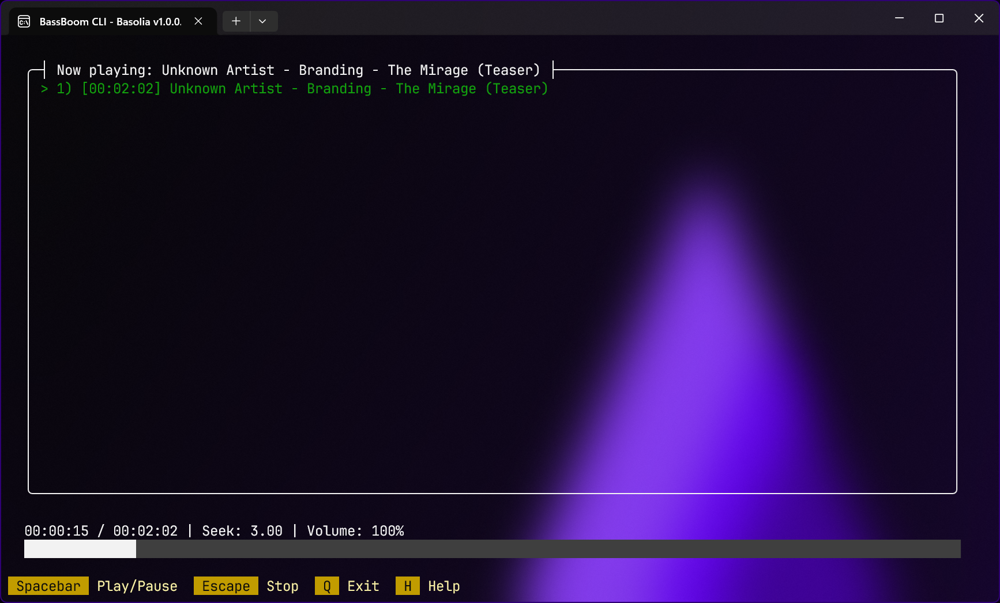

# Welcome!

<figure><figcaption></figcaption></figure>

BassBoom is a music player made with C# using the fast mpg123 library as the native backend that handles the music playback and song information, including the playback device information.

This library is a viable library aimed for cross-platform music playing because we've selected mpg123 as the MP3 backend library for its ease of use and for its fast music playback. This library is frictionless as it aims for stability and cross-platform compatibility.

In addition to your regular music files, BassBoom also supports online MPEG radio stations that you can use to play your own favorite radio stations.


When using BassBoom, here are the notes to consider:

* This library only supports MPEG audio files and streams. Unfortunately, this means no AAC and AAC+ support and no support for other non-MPEG audio files and streams.


To learn more about mpg123, visit this site:



mpg123 is licensed with [LGPL 2.1](https://mpg123.de/trunk/COPYING).
