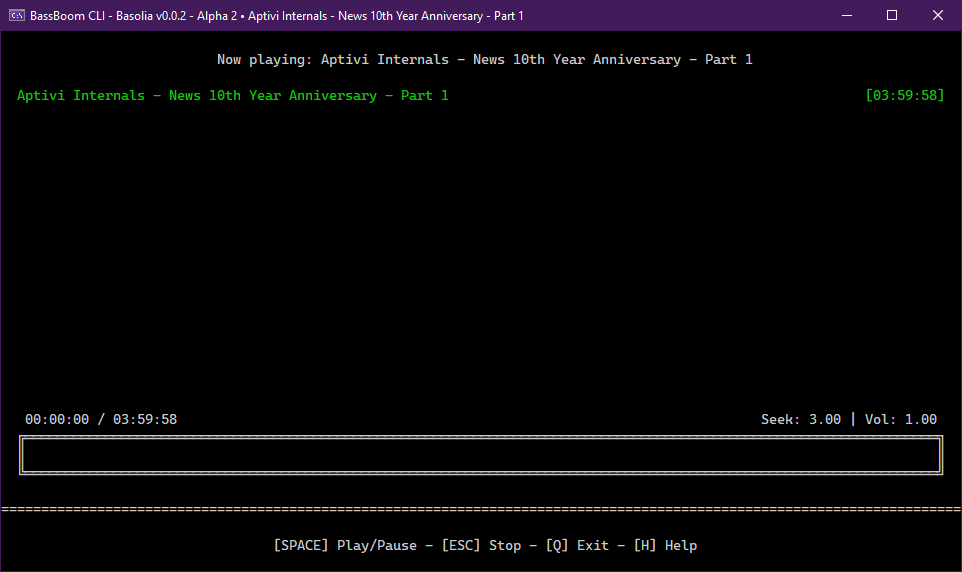

# 🎶 BassBoom CLI

<figure><figcaption></figcaption></figure>

BassBoom provides you its CLI version that allows you to play any music using just your terminal emulator. You can use this version if you need no GUI and just want to play music using just the textual UI.


Since the TUI version uses Terminaux to render its elements, you need to have a terminal emulator which supports VT sequences out of the box.


## Usage

You can run this program by either double-clicking an executable file, which will prompt you for the full path to a music file, or by opening the command prompt to the BassBoom.Cli binaries directory and writing the command like this:

* For Windows, `BassBoom.Cli.exe path/to/music.mp3`
* For Linux, `dotnet BassBoom.Cli.dll path/to/music.mp3`

Once done, BassBoom opens your music file to be ready for playing. Just play your music by pressing the spacebar.

## Controls

You can use the following keys to navigate through the entire music player. However, there are keys that don't do anything in modes that don't define such keys.

### Idle mode

When BassBoom.Cli is in idle mode (music not playing, music paused, etc.), you can use the following controls:

| Control    | Action                                                                  |
| ---------- | ----------------------------------------------------------------------- |
| `UP`       | Raises the volume                                                       |
| `DOWN`     | Lowers the volume                                                       |
| `SPACE`    | Plays the music                                                         |
| `B`        | Goes back to the previous song in the playlist and plays it             |
| `N`        | Goes to the next song in the playlist and plays it                      |
| `H`        | Shows the help menu                                                     |
| `I`        | Shows the song information, including the bit rate, artist, genre, etc. |
| `A`        | Adds a single song to the playlist                                      |
| `S`        | Adds songs from a music library directory to the playlist               |
| `R`        | Removes the current song                                                |
| `CTRL + R` | Removes all the songs                                                   |
| `E`        | Opens the interactive equalizer                                         |
| `Q`        | Exits the program                                                       |

### Playing mode

When BassBoom.Cli goes into this mode by playing any music, you can use these controls:

| Control        | Action                                                      |
| -------------- | ----------------------------------------------------------- |
| `UP`           | Raises the volume                                           |
| `DOWN`         | Lowers the volume                                           |
| `RIGHT`        | Seeks the music forward by the set seek rate                |
| `CTRL + RIGHT` | Increases the seek rate by 50 milliseconds                  |
| `LEFT`         | Seeks the music backward by the set seek rate               |
| `CTRL + LEFT`  | Decreases the seek rate by 50 milliseconds                  |
| `B`            | Goes back to the previous song in the playlist and plays it |
| `N`            | Goes to the next song in the playlist and plays it          |
| `SPACE`        | Pauses the music                                            |
| `R`            | Removes the currently playing song                          |
| `CTRL + R`     | Removes all the songs                                       |
| `ESC`          | Stops the song                                              |
| `H`            | Shows the help screen                                       |
| `I`            | Shows the song info                                         |
| `E`            | Opens the interactive equalizer                             |
| `Q`            | Exits BassBoom.Cli                                          |

### Equalizer screen

You can also modify how your song plays like in real-time using the interactive equalizer. You can use these controls:

| Control       | Action                                     |
| ------------- | ------------------------------------------ |
| `<-` / `->`   | Changes the current equalizer band's value |
| `UP` / `DOWN` | Selects the equalizer band                 |
| `R`           | Resets all values                          |
| `Q`           | Goes back to the player                    |
