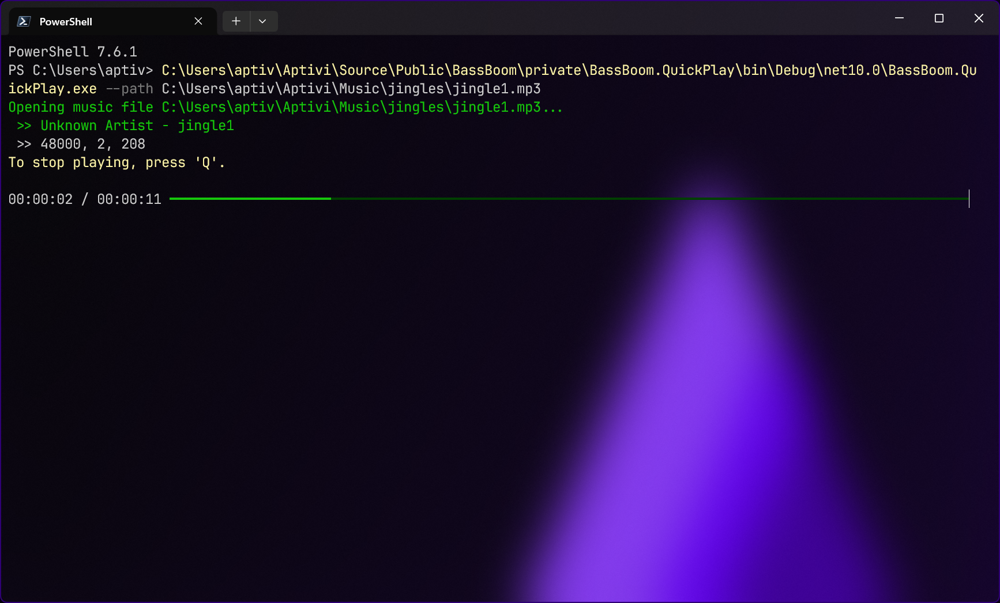

# BassBoom QuickPlay

<figure><figcaption></figcaption></figure>

In addition to the fully-fledged music player, QuickPlay provides you with a tiny command-line program that allows you to specify a path to your music file. This allows you to quickly play a sound file without having to open any music player, straight from your terminal emulator.

***

## <mark style="color:$primary;">Usage</mark>

To start using BassBoom.QuickPlay, you'll need to open the terminal emulator and run:


```shellsession
$ dotnet /path/to/BassBoom.QuickPlay.dll --path /path/to/music.mp3
```



For Ubuntu PPA installations, you can simply execute `bb-sndplay`, providing it with the same arguments.


Here are some of the more advanced usages:

<details>

<summary>More switches</summary>

<table><thead><tr><th width="249.666748046875">Switch</th><th>Description</th></tr></thead><tbody><tr><td><code>--path /path/to/music.mp3</code></td><td>Specifies a path to the music file you wish to play.</td></tr><tr><td><code>--quiet</code></td><td>Specifies whether to hide song information or not.</td></tr></tbody></table>

</details>

<details>

<summary>Keybindings</summary>

<table><thead><tr><th width="125">Keybinding</th><th>Description</th></tr></thead><tbody><tr><td><code>Q</code></td><td>Stops the music and exits the quick player.</td></tr></tbody></table>

</details>
